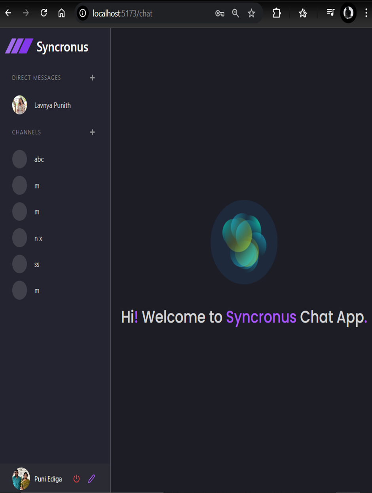
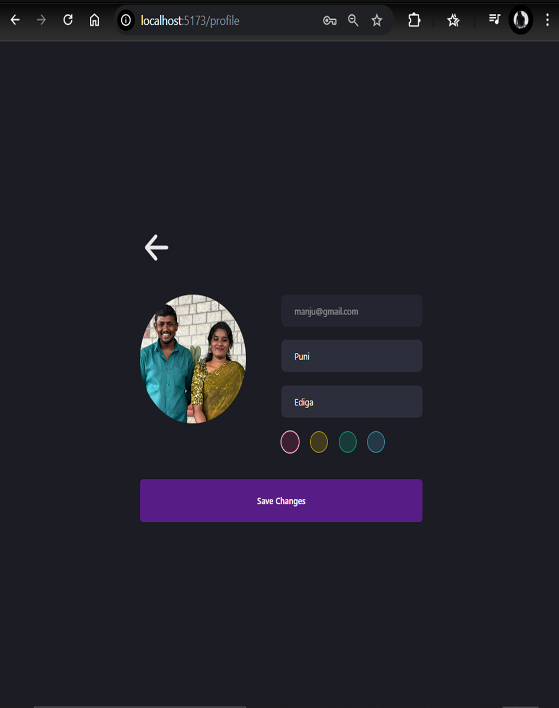
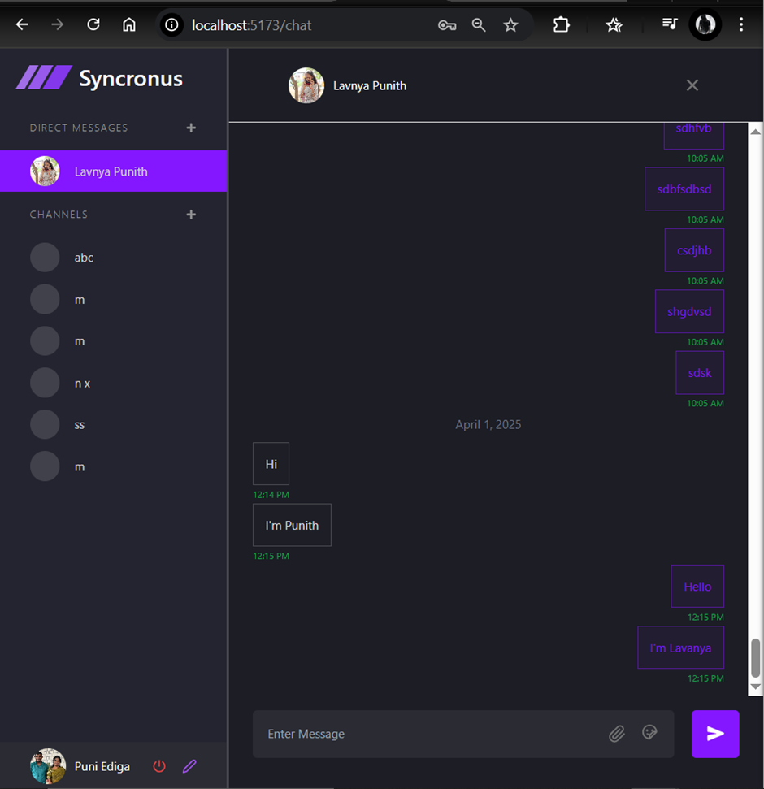

```markdown
# Real-Time Chat Application

## Description
This is a real-time chat application built with a modern tech stack. It allows users to communicate via direct messages and channels, share files, and customize their profiles. The application supports real-time updates using WebSockets and provides a seamless user experience.

## Features
- **Real-Time Messaging**: Instant communication using WebSockets.
- **Direct Messages and Channels**: Chat with individuals or groups.
- **File Sharing**: Upload and share files in chats.
- **Profile Customization**: Update profile details and avatars.
- **Responsive Design**: Works across devices with a clean UI.

## Tech Stack
- **Frontend**: React, TailwindCSS, Vite
- **Backend**: Node.js, Express, MongoDB
- **WebSockets**: Socket.IO
- **State Management**: Zustand

## Installation

### Prerequisites
- Node.js and npm installed
- MongoDB instance running

### Steps
1. Clone the repository:
   ```bash
   git clone https://github.com/your-username/real-time-chat-app.git
   cd real-time-chat-app
   ```

2. Install dependencies for both client and server:
   ```bash
   cd client
   npm install
   cd ../server
   npm install
   ```

3. Set up environment variables:
   - Create `.env` files in both `client` and `server` directories.
   - Add necessary variables (e.g., `DATABASE_URL`, `PORT`, `ORIGIN`).

4. Start the application:
   - Start the server:
     ```bash
     cd server
     npm start
     ```
   - Start the client:
     ```bash
     cd client
     npm run dev
     ```

5. Open the application in your browser:
   ```
   http://localhost:5173
   ```

## Screenshots
### Login Page


### Chat Interface


### Profile Page


## Folder Structure
### Client
```
client/
├── public/
├── src/
│   ├── components/
│   ├── context/
│   ├── pages/
│   ├── store/
│   ├── App.jsx
│   └── main.jsx
├── .env
├── package.json
└── vite.config.js
```

### Server
```
server/
├── controllers/
├── middlewares/
├── models/
├── routes/
├── uploads/
├── index.js
├── socket.js
├── .env
└── package.json
```

## Contributing
Contributions are welcome! Please fork the repository and submit a pull request.

## License
This project is licensed under the MIT License.
```

### Steps to Add This File
1. Create a new file named `README.md` in the root of your project.
2. Copy and paste the content above into the file.
3. Save the file.

Let me know if you need further customization!### Steps to Add This File
1. Create a new file named `README.md` in the root of your project.
2. Copy and paste the content above into the file.
3. Save the file.

Let me know if you need further customization!